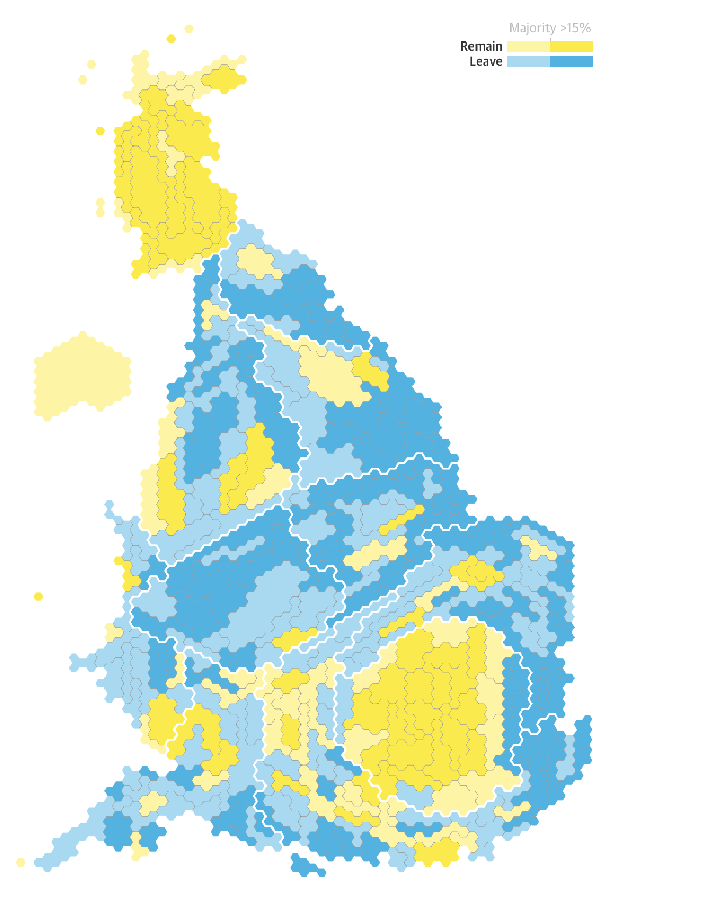
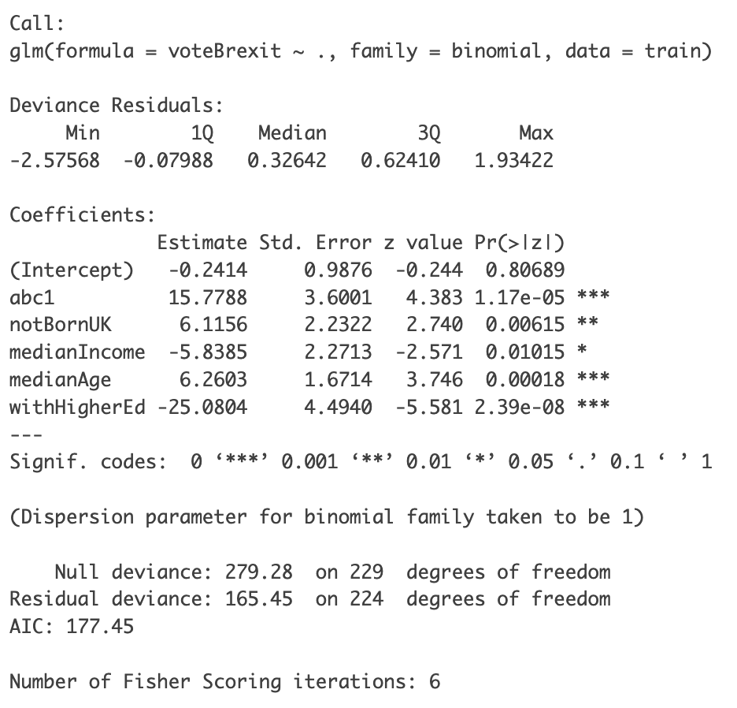
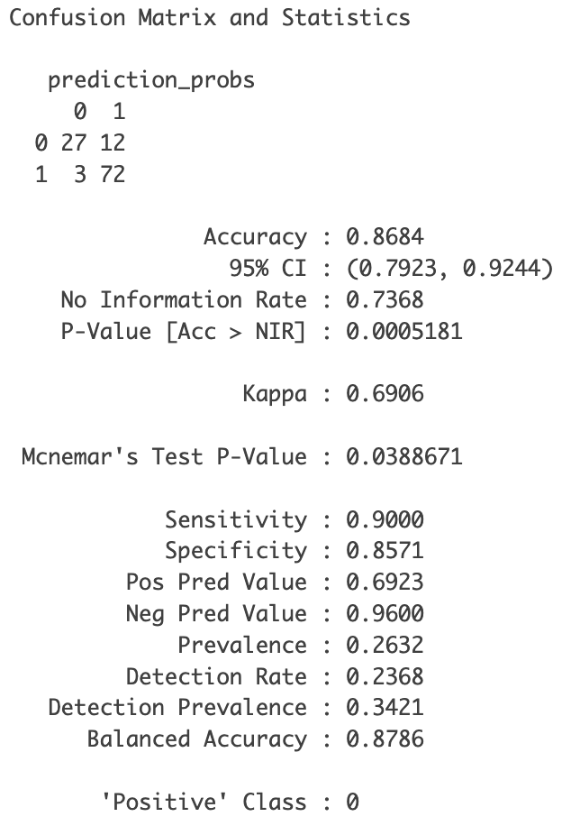
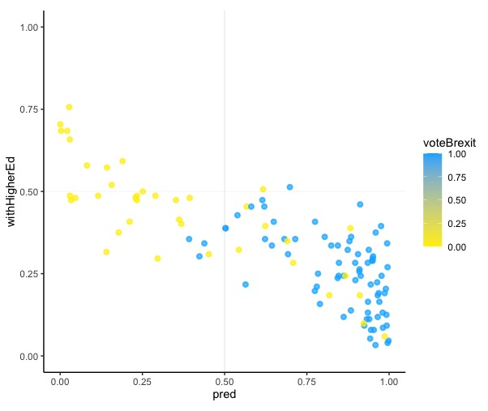
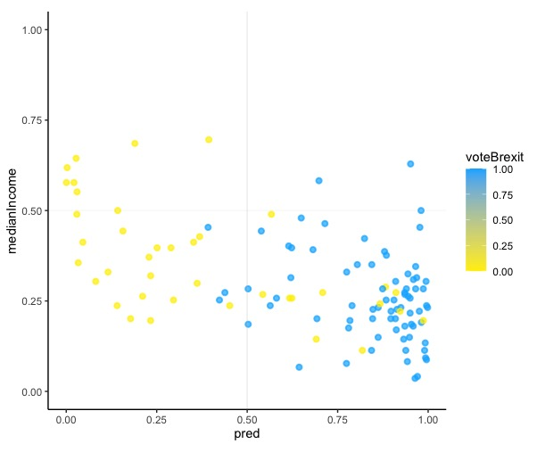
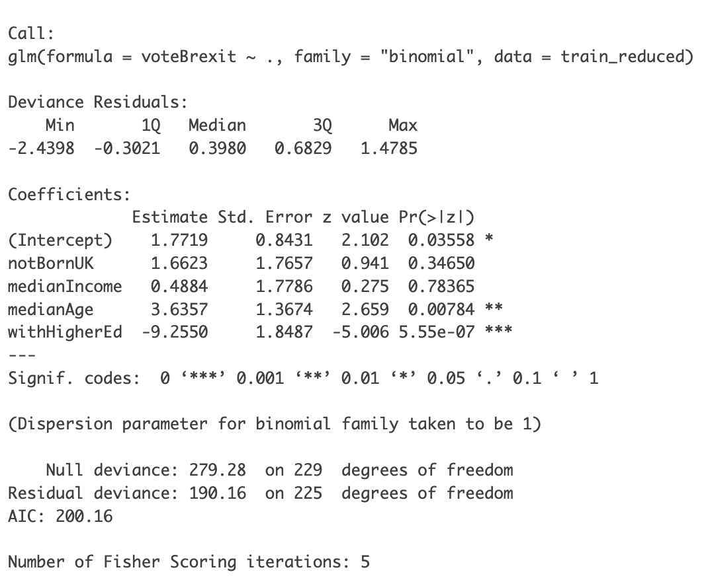
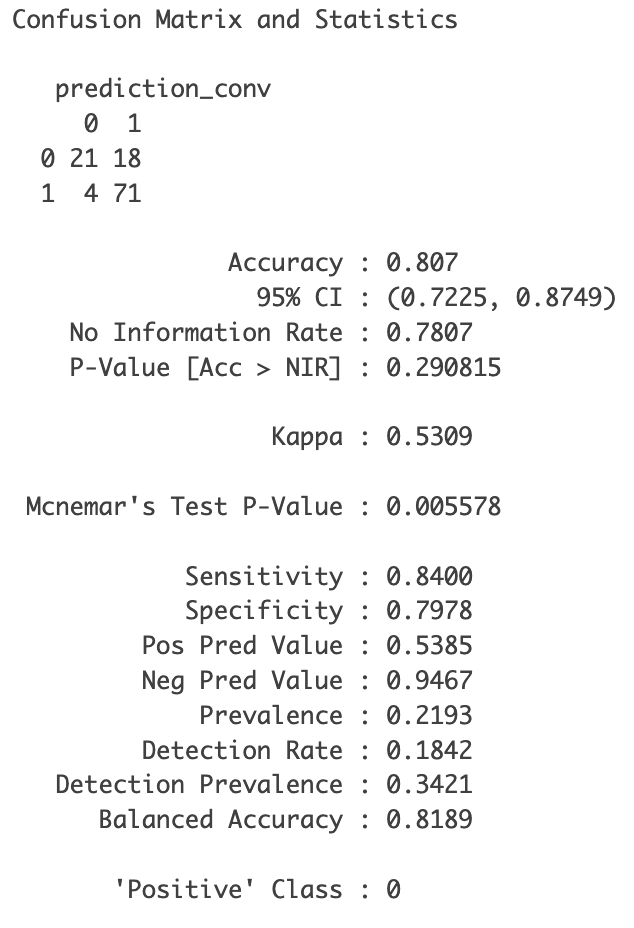

# Logistic Regression on Brexit
Prajwal Amin


Index
-----

- [Logistic Regression ](#logistic-regression)
    - [Configuring](#Configuring-R-and-data)
    - [Evaluation](#Evaluation)
    - [Visualization](#Visualization)
- [Factors affecting nterpretability](#factors-affecting-interpretability)
- [Addressing Collinearity](#addressing-collinearity)


In 2016, The UK had a national referendum to decide wether the country should leave or remain in the EU ('Brexit'). This was declared through an election where votes came from different wards comprising of certain proportion of people across England, Scotland and Wales. 




The Guardian newspaper presented some trends in modelling the outcome of voting. They have done the analysis but stopped at presenting the results graphically and commenting on the apparent patterns. Hence, we will use their analysis to compare our findings and perform some statistical analysis on the data. 

The data contains 6 variables including the output variable '*voteBrexit* which follows binary outcome. The variables are normalized so that the lowest value is 0 and highest is 1.

- abc1: proportion of individuals who are in the ABC1 social classes (middle to upper class) 
- medianIncome: the median income of all residents
- medianAge: median age of residents
- withHigherEd: proportion of residents with any university-level education
- notBornUK: the proportion of residents who were born outside the UK

In the tasks below, we will fit a logistic regression model, explore the coefficients which have greater effect on the output, discuss the difficulties faced in interpreting these coefficients of the model and finally adapt an alternative approach to overcome these difficulties. 

# Section 2

# Logistic Regression 

In this task we will fit a logistic regression model to the data to model the outcome of *voteBrexit* using all inputs. Through the  summary of the model, will find the direction and magnitude of each of the inputs. Out of which, we will also identify the inputs having strong effects on the outcome. Finally, we will discuss about the findings of the model and compare them with the plots featured on the Guardian.


## Configuring R and data

``` r
# Libraries
library(caTools)
library(ROCR)
library(ggplot2)
library(rpart)
library(lattice)
library(rpart.plot)
library(caret)

brexit <- read.csv("brexit.csv")

brexit$voteBrexit <- as.numeric(brexit$voteBrexit)

```


We will first split the data into training and testing using the ratio of 80:20. Then, will apply *train* data while training the model and *test* data for evaluation.

``` r
# Splitting the data (80:20 ratio).
set.seed(2)
split <- sample.split(brexit, SplitRatio = 0.8)

train <- subset(brexit, split == "TRUE")
test <- subset(brexit, split == "FALSE")
```


We will be using **glm** command in R to fit the data to the model. The "." (dot) indicates that all variables except *voteBrexit* to be used as inputs. Additionaly, *family = "binomial"* specifies the model to perform logistic regression.

``` r

# Training the model
model <- glm(voteBrexit ~ ., family = binomial, data = train)
summary(model)

```

 

The estimates of the coefficients given by the model can be used to determine the magnitude and direction for each of the inputs. The magnitude indicates the strength of the impact a variable has on the outcome, whereas direction is whether an impact is positive or negative. Hence, given below are the inputs ranked on decreasing order of magnitude.\

**1. withHigherEd:** 
This input variable has the highest magnitude compared to others. However, this has a negative impact on the outcome. As there is one unit increase in *withHigherEd*, the log-odds of voting for Brexit (TRUE) decreases by 25.08.

**2. abc1:**
This variable has both higher magnitude as well as positive impact on the outcome. A single unit increase in this variable results in an increase of 15.78 in the log-odds of voting for Brexit.

**3. medianAge:**
medianAge is a positive coefficient however the magnitude is not drastically high. An increase in one unit of this variable results in the increase of log-odds of voting for Brexit by 6.26.

**4. notBornUK:**
This variable is also similar to *medianAge* considering its effect on the outcome. This variable has an increasing effect on the outcome by 6.12.

**5. medianIncome:**
This variable has the least magnitude among all others, and the impact too is negative. A unit increase in medianIncome will decrease the log-odds of voting for Brexit by 5.84. \

Apart from this, we can also observe that **p-value** for all of the inputs are below $<0.05$ which suggests that the inputs are statistically significant. Although, the best predictor in modelling the outcome is **withHigherEd** (proportion of individuals with higher degree). The magnitude of this variable is exceptionally high and the p-value is quite low too.


## Evaluation

In order to evaluate the model we will first need to perform predictions using the trained model. Note that, while making predictions *test* data will be used.

``` r
# Making predictions
pred <- predict.glm(model,test, type = c("response"))

# Converting predictions to 0 or 1
prediction_probs <- ifelse(pred > 0.5, 1, 0)

```

We will evaluate using **confusion matrix** metric from *caret* package which also provides the accuracy for the model.


``` r

# Create a confusion matrix
cm <- confusionMatrix(table(test$voteBrexit, prediction_probs))
cm

```

 

The TP and TN rate is high and the accuracy is $\approx 87 \%$ which is satisfactory for this model.

## Visualization

The predictions contain the probability of each electoral ward voting for Brexit.
Hence, using the predictions, we can visualize and model the output for each of the inputs. First we will use *withHigherEd* variable against the model predictions to identify any patterns that is evident. We will also imagine a decision boundary so that if probability is $> 0.5$, the individual is likely to vote and if it is $< 0.5$ he will not.

``` r

# Plotting withHigherEd against Predictions.
ggplot(test, aes(x=pred, y=withHigherEd, color = voteBrexit)) + 
  geom_point(alpha=.7, stroke = 1, size=1.5) +
  geom_line(aes(x = 0.5, y = 0.5)) +
  scale_color_gradient(low = "#ffee00", high = "#00b3ff") +
  theme_classic() +
  labs(title = "Proportion of individuals with higher degree", x = "Remain (Yellow) / Leave (Blue)", y = "Proportion") +
  coord_fixed(xlim = c(0, 1), ylim = c(0, 1)) + # set fixed axis ranges
  geom_vline(xintercept = 0.5, color = "gray", alpha = 0.5) + # add vertical line at x-mean
  geom_hline(yintercept = 0.5, color = "gray", alpha = 0.1) # add horizontal line at y-mean
  
```
 

The graph clearly shows that a ward with less than 50% of people with higher degree, is more likely to vote for leave. The correlation of the variables is strongly negative ($\approx -0.79$).

``` r

# Plotting withHigherEd against Predictions.
ggplot(test, aes(x=pred, y=medianIncome, color = voteBrexit)) + 
  geom_point(alpha=.7, stroke = 1, size=1.5) +
  geom_line(aes(x = 0.5, y = 0.5)) +
  scale_color_gradient(low = "#ffee00", high = "#00b3ff") +
  guides(fill = 'none') +
  theme_classic() +
  labs(title = "Median income of the individuals", x = "Remain (Yellow) / Leave (Blue)", y = "Proportion") +
  coord_fixed(xlim = c(0, 1), ylim = c(0, 1)) + # set fixed axis ranges
  geom_vline(xintercept = 0.5, color = "gray", alpha = 0.5) + # add vertical line at x-mean
  geom_hline(yintercept = 0.5, color = "gray", alpha = 0.1) # add horizontal line at y-mean

```

 


Overall, *withHigherEd* seems like a good predictor for *voteBrexit*. In comparison to the findings featured on the Guardian website, it appears that their plots agree with the plots produced in this report and the difference is insignificant. The possible reasons for the patterns to vary might be due to the data that has been used to generate the plots or adapting different approaches in training the model. Further, the data points plotted on the website are classified much accurately compared to this report.


# Factors affecting interpretability

Since we have used a logistic regression model, there are certain factors that affect the interpretability of the coefficients fitted to the model, these are:

**1. Linearity**
Similar to linear models, logistic regression assumes that there exists some linearity in the relationship between the variables. However, if non-linear then the model might not capture true effect of the variables, which might be misleading while interpreting the coefficients.

**2. Sample Size**
It is always a good idea to perform predictions using large sample size, the results obtained using small sized data sets may sometimes produce inaccurate results. The standard errors of the coefficients might be high, thus leading the coefficients to be unstable.

**3. Normalization**
Normalization rescales the input variables so that they have similar scales, which can help in interpreting the coefficients. But, sometimes interpretation might be difficult especially when variables with non-linear relationship have been normalized. Moreover, different variables will be measured in different scales which will get affected due to this process.

**4. Collinearity **
This occurs when the correlation between the input and output variables are exceptionally high, which might make it hard to determine the individual effect of each variable and finding out which variable is relevant for the output.


Although, it is discussed in *Task 1* that the coefficients are interpreted in such a way that as one one unit increase in that variable increases the log-odds of the *output* by *coefficient value* when all other variables are held constant. This should not be considered as the only decision rule in determining the relationship between the input and output variables, as there might be other demographic factors that influence the decision to vote for or against Brexit.

Further, taking into account the factors mentioned above, it is not always reliable to determine the input variables based on their decreasing effect on the output. If done so there might be some uncertainty in the ordering. However, there is one approach through which we can address the concept of **collinearity**. For this, we will use **VIF** (Variance Inflation Factor) from the *car* package.

``` r
library(car)
vif(model)

```


Here, it is clearly noticeable that the VIF values for *abc1* and *withHigherEd* is above 5 which is considered to be as normal. This indicates that these two variables have high collinearity with the output. In Contrary, the other features have low VIF values which shows that they have greater independence on predicting the outcome. 

Therefore, considering the factor of collinearity  as well as the nature of the data, we might determine the ordering of the relevant features in decreasing order of their effect:

**1. medianIncome**
Income level often signifies the level of importance in voting for an individual.

**2. medianAge**
Age determines different political behavior among humans, hence the importance of this variable might be relevant.

**3. notBornUK**
An individual whether born or not in UK might have only considerable effect.

**4. withHigherEd**
An individual with a higher degree will be well equipped with political knowledge, however VIF is high.

**5. abc1**
The individuals belonging to different socioeconomic groups possess different political attitudes or behaviour. Considered least as it is subject to high VIF.

As always these observations are subjective and the actual ordering varies in different scenarios. Moreover, factors such as sample size, linearity and normalization could also influence the ranking of these variables. In the upcoming task, we will deal with this problem of misinterpretation of the variables by following a alternative approach resolving the issue of **collinearity**.


# Addressing Collinearity

An alternative approach to carry out the analysis for task 1 would be to create another logistic regression model, however by excluding the variables which are subject to collinearity. Out of the variables we observed: *abc1* and *withHigherEd*, we will only remove *abc1* while training the model because even though *withHigherEd* is higlhy correlated it also a good predictor of the output compared to the rest of the variables.

We will create a subset of the data by removing the *abc1* column using *dplyr* package

``` r

library(dplyr) 

# Removing 'abc1' column from the dataset
brexit_reduced <- select(brexit, -abc1)

```

We will split the data once again using the same split (80:20).

``` r

# Splitting the data into training & testing (80:20)
set.seed(2)
train_reduced <- subset(brexit_reduced, split == "TRUE")
test_reduced <- subset(brexit_reduced, split == "FALSE")

```

Now we can fit the model using training data

``` r

# Training the model
model_new <- glm(voteBrexit ~ ., data = train_reduced, family = "binomial")
summary(model_new)
```


``` r
vif(model_new)

```


The VIF values for all the variables are low, and surprisingly, notice that *withHigherEd* has also reduced.

## Evaluation

We can now use this model to make predictions, then evaluate the model performance using confusion matrix.

``` r

# Making predictions
predictions_new <- predict(model_new, newdata = test_reduced, type = "response")

# Converting predictions to 0 or 1
prediction_conv <- ifelse(predictions_new > 0.5, 1, 0)

# Evaluate using confusion matrix
cm2 <- confusionMatrix(table(test_reduced$voteBrexit, prediction_conv))
cm2

```


This signifies that the number of instances which have been correctly classified is less compared to the model from task 1. The accuracy of both the models proves this as the former model produced $\approx 87 \%$ and the latter $\approx 81 \%$. The second model was trained with fewer variables to avoid collinearity, which might be the reason in achieving less accuracy, thus making the model less dependable in making predictions.

As we have followed this alternative approach, it comes with certain advantages and disadvantages which are listed down below:

## Advantages

- Interpretability: Addressing collinearity by removing highly correlated variables makes it easier to interpret the coefficients of the model.

- Improves Performance: The model becomes much stable in making predictions and also reduces the being prone to overfitting.

- Feature selection: Simplifies the process of selecting features that are relevant for the model to perform better. 

## Disadvantages

- Loss of Information: In some cases there might be only few variables remaining after removing collinear variables which provides lack of information to the model.

- Loss of strong predictors: There might certain variables which act as strong predictors to the outcome and these might be removed due to collinearity.

- Poor results on small sample sizes: The values obtained by VIF could be unstable with small sample sizes, as sufficient data is required to provide accurate estimates.
